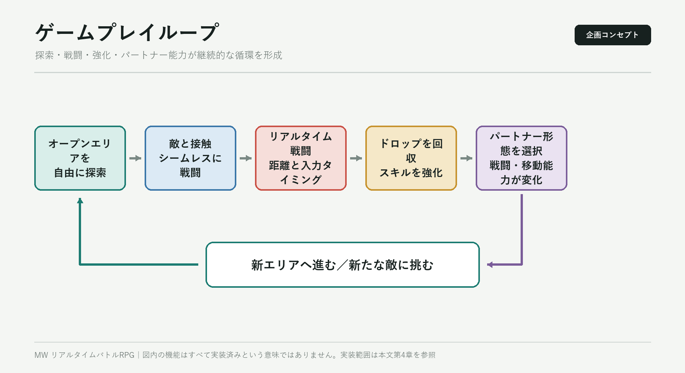
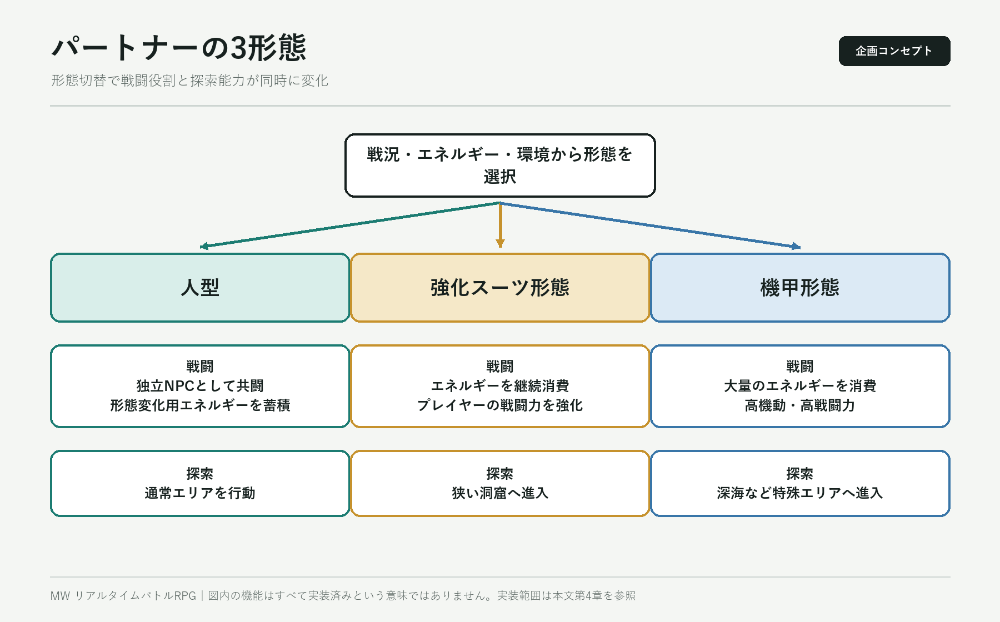
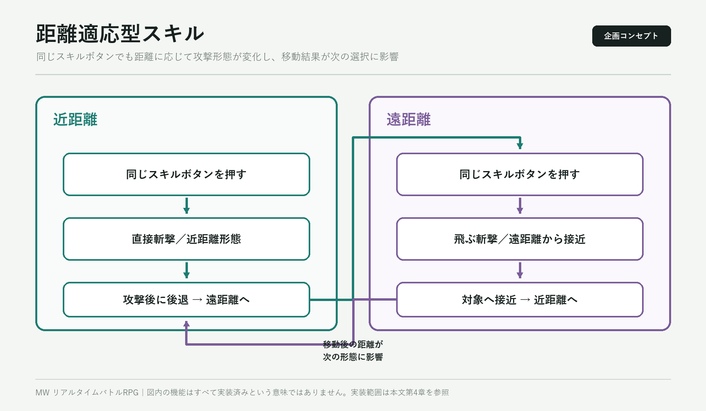
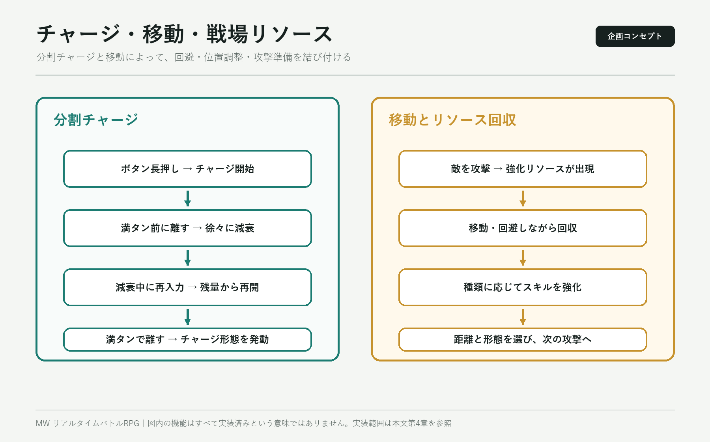
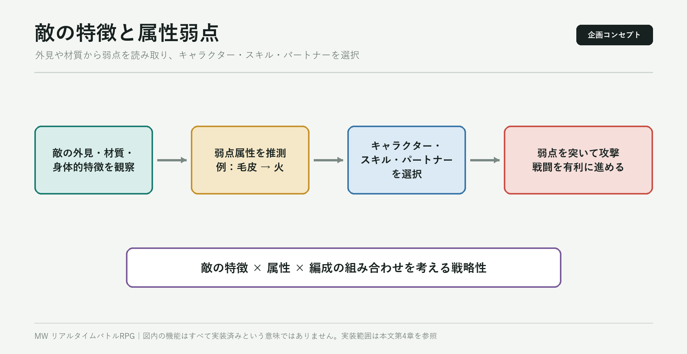
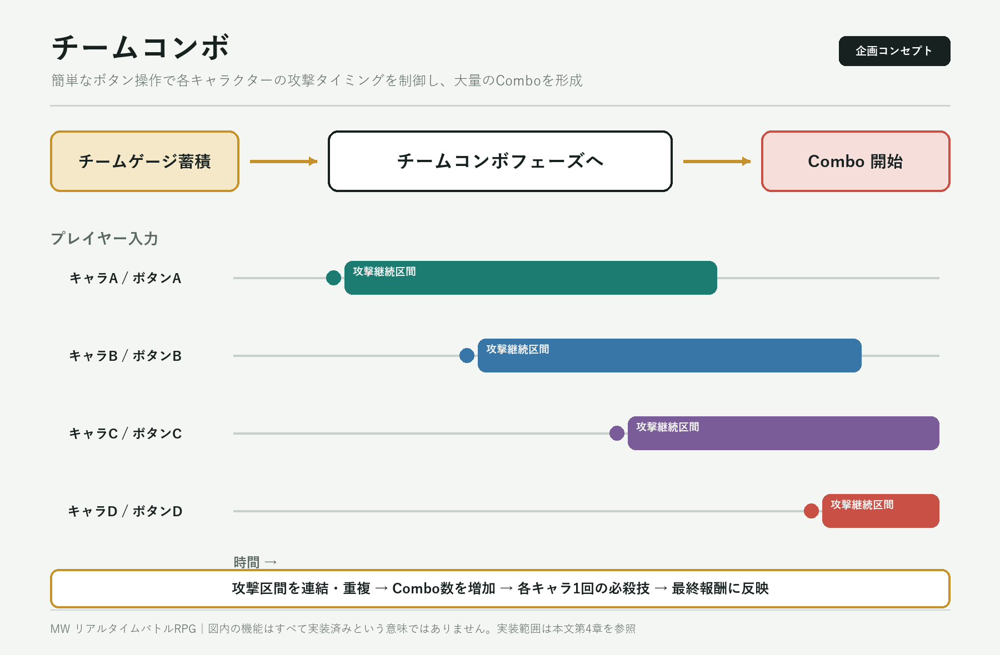
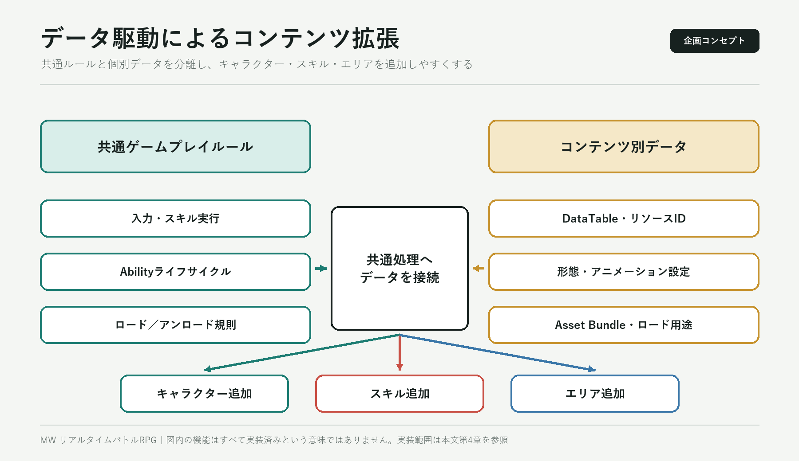

# MW リアルタイムバトルRPG システム技術プロトタイプ

## 1. プロジェクト基本情報

| 項目 | 内容 |
|---|---|
| プロジェクト種別 | 業務外での個人開発／技術検証プロジェクト |
| プロジェクト概要 | リアルタイムバトルRPGに向けた戦闘システムおよびリソース管理の技術プロトタイプ |
| 開発環境 | Unreal Engine 5、C++、Python、Blender |
| 主な技術 | Gameplay Ability System、Enhanced Input、Primary Asset、Asset Manager、MVVM |
| 個人担当 | ゲームプレイ企画、システム設計、C++実装、データ／リソース管理、EditorおよびDCCスクリプト |
| 現在の状態 | 主要モジュールはコードとして実装済み。戦闘全体のプレイ可能なループは未完成 |

> 本プロジェクトは個人開発によるシステム技術プロトタイプであり、未実装の要素も多く残っています。本資料では、実装済みの内容と未実装の企画を明確に区別して記載します。

### 1.1 デモ動画／ソースコード

- **デモ動画**：[MW_Demo.mp4](MW_Demo.mp4)（距離に応じたスキル形態の切り替え、およびUnreal Engineへインポートしたモデルの表示結果）
- **ソースコード**：[GitHub - MWProject / Demoブランチ](https://github.com/aleidi/MWProject/tree/Demo)（応募作品レビュー用ブランチ）

## 2. 開発背景と目的

業務では、大規模プロジェクトの一部モジュールを担当することが中心でした。そこで、プロジェクト構成をゼロから計画し、モジュールごとの責務を分け、システム間の依存関係を整理する経験を積むため、個人プロジェクトとしてMWの開発を開始しました。また、自分が好むRPGのゲームプレイを、実行可能かつ拡張可能なプログラム構造へ落とし込み、これまでに培ったUnreal EngineのGameplay実装、システム設計、データ／リソース管理、UI、開発ツールに関する知識を一つのプロジェクトで総合的に活用することも目的としました。

ゲームプレイ面では、主に『ゼノブレイド』シリーズから着想を得ています。戦闘操作については、『Z.O.E.』シリーズに見られる、距離やチャージ状態に応じて攻撃挙動が変化する設計も参考にしました。

当初設定した目標は以下の通りです。

- オープンエリアを自由に探索し、シームレスにリアルタイム戦闘へ移行する
- プレイヤーが1人のキャラクターを操作し、複数のNPCパートナーと共闘する
- 同じスキルが対象との距離に応じて近距離形態／遠距離形態へ切り替わる
- アクションゲームのような高い入力速度を要求せず、チャージによってスキル効果を変化させる
- 戦闘中の移動を、回避だけでなく強化リソースの能動的な回収にも活用する
- パートナーの形態変化を通じて、戦闘能力とマップ探索能力を結び付ける
- データ駆動設計と非同期リソースロードにより、キャラクター、スキル、エリアコンテンツの拡張に対応する

これらは独立した機能の一覧ではなく、探索、戦闘、キャラクター成長、パートナーとの協力を一つのゲーム体験として構成するための目標です。以下では、最初にゲームプレイ全体の設計を示し、その後に現在コードとして実装されている範囲を説明します。

## 3. ゲームプレイ設計概要

### 3.1 ゲームプレイループ

プレイヤーはオープンエリアを探索し、マップ上の敵と接触するとシームレスにリアルタイム戦闘へ移行します。戦闘では1人のキャラクターを操作し、複数のNPCパートナーと共闘します。スキルでダメージを与えながら敵との距離を調整し、戦場に出現する強化リソースを能動的に回収します。戦闘終了後は探索を再開し、周囲の環境や次の戦闘に応じてパートナーの形態を選択します。

パートナーは複数の形態へ切り替えることができ、形態ごとに戦闘方法だけでなく、進入可能なマップ領域も変化します。これにより、「エリア探索 → 敵との遭遇 → リアルタイム戦闘 → 強化獲得 → パートナー形態の選択 → 新エリアへの進入」という循環を構成し、戦闘と探索が互いに影響する設計を目指しました。



### 3.2 パートナー形態と探索能力

パートナーシステムでは、以下の3形態を想定しています。

| 形態 | 戦闘での役割 | 探索での役割 |
|---|---|---|
| 人型 | 独立したNPCとしてプレイヤーを支援し、形態変化に必要なエネルギーを蓄積する | 通常エリアを行動できる |
| 強化スーツ形態 | エネルギーを継続的に消費し、プレイヤーの戦闘能力を強化する | 機甲では進入できない狭い洞窟などへ入れる |
| 機甲形態 | 大量のエネルギーを消費し、高い機動力と戦闘能力を得る | 人間の身体では耐えられない深海などへ進入できる |

形態変化を単なるパラメーター強化にせず、パーティ構成、戦闘戦略、マップ上の移動可能範囲を同時に変化させることを狙った設計です。プレイヤーは戦況、エネルギー残量、探索環境に応じて使用する形態を判断します。



### 3.3 距離適応型スキル

同じスキルでも、キャラクターと対象との距離に応じて、近距離形態または遠距離形態へ自動的に切り替わります。両形態は同じスキルコンセプトを共有しながら、攻撃表現、効果範囲、キャラクターの移動方向を変化させます。現在の位置に適した攻撃を行うだけでなく、そのスキルによる移動が次の攻撃距離にも影響します。

例えば、エネルギーブレードを使うスキルの場合、近距離では対象を直接斬り、遠距離では飛ぶ斬撃を放ちます。移動を伴うスキルであれば、近距離攻撃後に大きく後退する形態と、遠距離から対象へ飛び込む形態を同じスキルにまとめられます。直前のスキルによって生まれた新しい位置関係が、次のスキル形態を変えるため、スキル選択、位置調整、コンボ順序が戦闘のリズムを形成します。

アクションゲームのような高頻度入力を重視するのではなく、少ないボタン数で、位置とスキル順序を考える操作を提供することを目的としています。



### 3.4 チャージ、移動、戦場リソース

スキルボタンを押し続けるとチャージ値が増加し、最大まで蓄積した後にボタンを離すとチャージ形態を発動します。最大に達する前にボタンを離した場合、チャージ値は即座にゼロへ戻るのではなく徐々に減衰します。減衰中に再度ボタンを押すと、残っている値からチャージを再開できます。これにより、プレイヤーは移動や回避を挟みながら、スキルを分割して準備できます。

また、敵を攻撃すると種類の異なる強化リソースが出現し、それぞれ対応するスキルを強化する設計です。プレイヤーはリソースを回収するために位置を調整する必要があり、移動が回避、位置調整、次の攻撃準備という複数の役割を持ちます。距離適応型スキル、分割チャージ、リソース回収を相互に関連させることで、戦闘中の移動に判断要素を持たせます。



### 3.5 属性弱点とチームコンボ

敵の外見や材質などの特徴に応じて属性弱点を設定します。例えば、毛皮を持つ敵は火属性に弱いというように、プレイヤーが敵の特徴、キャラクターのスキル、パートナー能力を組み合わせて攻撃方法を選択できる設計です。



チームコンボは、戦闘設計における重要な機能です。チームゲージが一定量まで蓄積すると、『ヴァルキリープロファイル』や『PROJECT X ZONE』のようなチームコンボフェーズへ移行します。参加キャラクターは全員このフェーズ中に攻撃でき、プレイヤーは各キャラクターに対応するボタンを押すタイミングによって攻撃開始時点を決めます。複数キャラクターの攻撃を連続させたり、同時に重ねたりすることで、複雑なコマンド入力を要求せずにコンボ数を大きく伸ばす爽快感を提供します。

各キャラクターは、1回のチームコンボ中に必殺技を1回だけ使用できます。最終的な報酬はコンボ数と必殺技の活用結果の両方から影響を受けるため、チームコンボは演出やダメージだけでなく、戦闘報酬にも直結します。キャラクターごとの攻撃テンポ、持続時間、属性、必殺技効果によってコンボのつながり方が変わるため、各ボタンを押すタイミング、攻撃の組み合わせ、敵の弱点に合わせたパーティ編成を研究する動機につながります。



### 3.6 データ駆動によるコンテンツ拡張方針

オープンエリア、複数キャラクター、多数のスキルによるコンテンツ規模を想定し、キャラクター、スキル、エリアをDataTable、リソースID、オンデマンドロードによって管理する方針としました。ゲームプレイコードは共通ルールを処理し、キャラクター、スキル形態、アニメーション、リソースはデータから設定します。これにより、共通処理を繰り返し変更せずにコンテンツを追加できる構造を目指しました。



## 4. 現在の実装範囲

上記は当初計画したゲーム全体の設計であり、現時点でコードとして実装されているのはその一部です。現在の状態を以下に示します。

| モジュール | 現在の状態 | 実装済みの内容 | 未実装／未検証の内容 |
|---|---|---|---|
| スキル入力／実行 | 基礎実装 | InputTagの振り分け、スキルスロットの解決、Gameplay Event、Abilityライフサイクル | 正式なヒット処理と戦闘結果までの接続 |
| 距離適応型スキル | 基礎実装 | 対象との距離に応じた、同一Montage内の`Close`／`Far` Section選択 | 正式な対象フィルター、距離ヒステリシス、完成したスキル演出 |
| チャージ入力 | 基礎実装 | 蓄積、途中でのボタン解放、減衰、再チャージ、最大チャージ後の発動 | スキルアセットとの完全な接続、エンドツーエンドの動作検証 |
| プレイヤー／AI共通スキル経路 | 基礎実装 | InputTagとSkillIdを`FMWSkillCastCommand`へ統合 | 完成したAI意思決定とNPC連携 |
| 属性／ダメージ | 処理フロー実装 | AttributeSet、Gameplay Effect、Execution Calculation、Health更新 | アニメーションヒットとの接続、属性弱点、正式なダメージルール |
| キャラクターリソース管理 | 主要経路を実装 | Primary Asset Bundleの非同期ロード、AbilitySet適用、`EndPlay`でのアンロード | 完全な失敗復旧と所有権ルール |
| スキルリソース管理 | インターフェース実装 | DataTableキャッシュ、Primary Asset ID、同期／非同期ロードAPI | 装備、発動、アンロードタイミングとの完全な接続 |
| UI／MVVM | 基礎フレームワーク | UIレイヤー、Widgetキャッシュ、一部の戦闘ViewModel | 最終レイアウト、リソース、完全なデータバインディング |
| パートナー／探索 | 初期フレームワーク／企画 | パートナーActorとの関連付け、Gameplay Event、パートナーAbilityの初期構造 | 3形態、エネルギー循環、NPC連携、エリア制限 |
| その他の戦闘要素 | 企画段階 | ゲームプレイルールとシステム間関係の設計 | ドロップ強化、属性弱点、チームコンボ、戦闘全体のプレイ可能なループ |

したがって、本プロジェクトの現在の位置付けは、完成したゲームではなく、完成版相当の規模を想定してリアルタイムバトルRPGの全体像を設計し、その中核システムの一部をコードへ落とし込んだUnreal Engine C++技術プロトタイプです。

## 5. 個人担当範囲

本プロジェクトでは、ゲームプレイ企画、技術選定、構造設計、コード実装を一人で担当しました。主な担当内容は以下の通りです。

- InputTagを用いたスキル入力振り分けの設計／実装
- プレイヤーとAIが共用するスキル発動コマンドおよびAbility起動経路の設計
- 距離適応型スキルと、ボタン解放後の減衰／再入力によるチャージ再開に対応した入力処理の実装
- GASを用いたスキルライフサイクル、属性、基礎ダメージ処理フローの構築
- DataTable、Primary Asset、Asset Bundleを用いたキャラクター／スキルデータの管理
- UIレイヤー管理、Widgetキャッシュ、一部の戦闘ViewModelの実装
- Unreal Editor補助機能およびBlender Pythonリソース処理スクリプトの作成

GAS、入力処理、一部の基礎フレームワークについては、Epic GamesのLyra Sample Gameを参考にしています。その構造を本プロジェクト向けに取捨選択し、プロジェクト固有のスキルコマンド、距離形態、チャージルール、スキルデータ、リソース接続を追加しました。リポジトリ内のGameFeatureなど、学習目的で取り込んだ参考実装は個人の成果には含めていません。

## 6. システム全体の処理構成

```text
プレイヤー InputTag ─┐
                      ├→ SkillComponent → SkillCastCommand → Gameplay Event
AI SkillId ──────────┘                                      ↓
                                                          GAS Ability
                                                             ↓
                                    距離／チャージ形態 → Commit → Montage

Character／Skill ID → DataTable → Primary Asset ID → Asset Bundle
                                                        ↓
                                             リソースをロードし実行オブジェクトへ接続
```

入力元、スキルルール、Abilityライフサイクル、リソース検索をそれぞれ別のモジュールへ分けています。これにより、すべての判定をPlayerController、Character、単一のAbilityへ集中させず、プレイヤーとAIが下流の実行処理を共用できる構造としました。

## 7. 代表的な技術課題と解決方法

### 7.1 プレイヤーとAIのスキル実行経路を統一

**課題**

スキルはプレイヤー入力またはAI判断から発動されます。両者が別々のAbilityへ入り、コスト消費やアニメーション処理も個別に実装されると、スキル形態を追加するたびに処理が重複し、ルールの一貫性も保ちにくくなります。

**判断・設計**

入力元とスキル実行を分離しました。プレイヤー側ではInputTagからスキルスロットとSkillIdを解決し、AI側ではSkillIdを直接指定します。どちらも最終的に`FMWSkillCastCommand`を生成し、Gameplay Eventを通じて同じAbilityへ渡します。

**実施内容**

- `AMWPlayerController`で通常スキル、チャージスキル、その他Ability入力を振り分ける
- `UMWSkillInputService`で入力要求を対象PawnのSkillComponentへ転送する
- `UMWSkillComponent`で習得スキル、装備スロット、実行時の使用回数を管理し、共通の発動コマンドを生成する
- `UMWSkillBase`でコマンドを解析し、検証、Commit、Montage再生、終了処理を行う

**結果**

プレイヤーのInputTagとAIのSkillIdを、同一のスキル実行経路へ統合しました。Ability側は、要求元がキーボード、ゲームパッド、AIのいずれであるかを意識せず、コスト消費、リソース解決、アニメーションライフサイクルを共用できます。AI側は呼び出し口のみ実装しており、AI意思決定システム全体は未実装です。

### 7.2 距離とチャージ状態による同一スキルの形態変化

**課題**

同じスキルボタンでも、プレイヤーと対象との距離、および現在のチャージ状態に応じて異なる結果を出し、少ないボタン数のまま入力タイミングと状態変化による操作の幅を持たせることを目指しました。そのためには、距離と入力状態を安定してスキル実行段階へ渡し、各形態で共通の発動フローを利用する必要がありました。

**判断・設計**

スキルの入口は共通化したまま、「入力状態」と「対象との距離」を、発動コマンドおよびAbility実行段階における形態決定条件として扱いました。

- `UMWChargeInputProcessor`でCharge InputTagごとのチャージ状態を個別に管理する
- `UMWRangeAdaptiveSkill`でAbility実行前に対象との距離を判定し、近距離／遠距離形態を選択する
- 各形態を同一Montage内の異なるSectionへ割り当て、スキルライフサイクルを共用する

**実施内容**

- ボタン押下、チャージ蓄積、途中解放、段階的な減衰、再入力による継続、最大チャージ後の発動を実装
- Charge InputTagごとに状態を保持し、複数スキルのチャージ値が干渉しない構造を実装
- 対象との距離に応じて`Close`／`Far` Sectionを選択
- 対象が見つからない場合に、発動中止、近距離形態、遠距離形態のいずれを使用するか設定可能な入口を用意

**結果**

通常／チャージ入力の振り分け、最大チャージ前にボタンを離した後の減衰、残量からの再チャージ、および距離に応じたMontage Section選択までをコードとして実装しました。同じボタンから位置とチャージ状態に応じた異なる形態を選択でき、スキル間の距離調整と連続使用の基盤となっています。

対象の敵味方フィルター、対象優先度、距離境界でのヒステリシス、実際のヒットからダメージまでの接続は未完成です。そのため、現段階では完成した戦闘機能ではなく、基礎実装として位置付けています。

実際の距離判定によるスキル形態の切り替えは、[デモ動画](MW_Demo.mp4)で確認できます。

### 7.3 キャラクターのライフサイクルに基づくリソース管理

**課題**

キャラクター、アニメーション、AbilitySet、スキルアセットをすべてハード参照で常駐させると、キャラクターやスキルの増加に伴って起動時ロードとメモリ使用量が増加します。一方、非同期ロードAPIだけを個別に用意しても、いつロードし、いつアンロードするかが不明確になります。

**判断・設計**

DataTable、Primary Asset、Asset Bundleを組み合わせ、軽量データと実リソースを管理しました。

- DataTableにID、軽量設定、アセット参照を保持する
- Data ManagerでIDからデータ行およびPrimary Asset IDへの検索経路を構築する
- Asset Bundleで`Spawn`、`Extra`などのロード用途を分ける
- Characterのライフサイクルに合わせてSpawn Bundleをロード／アンロードする

**実施内容**

- Characterの`BeginPlay`でSpawn Bundleの非同期ロードを要求
- ロード完了後にCharacter Assetを取得し、Ability SystemへデフォルトAbilitySetを適用
- Characterの`EndPlay`で対応するPrimary Assetをアンロード
- Skill DataManagerにデータキャッシュ、同期／非同期Bundleロード、ロード済みアセット取得、アンロードAPIを実装

**結果**

Characterについては、ロード要求、完了コールバック、AbilitySet適用、`EndPlay`でのアンロードまでの一連のコード経路を実装し、キャラクターリソースと実行オブジェクトのライフサイクルを対応付けました。

Skill DataManagerには同期／非同期ロードおよびアンロードAPIがありますが、現在の装備／発動経路ではロード済みSkill Assetの取得のみを行っており、ロードAPIはまだ呼び出していません。ロードを開始する処理とアンロード時点は、現在のスキルフローへ未接続です。

## 8. 補足実装

### 8.1 GASによる基礎ダメージ処理

AttributeSet、Gameplay Effect、Execution Calculationを使用し、GAS内でダメージ計算結果を対象のHealth更新へ反映する基礎処理フローを実装しました。

### 8.2 UI ManagerとMVVM

- UI ManagerとRoot Canvasを通じて、Widgetの生成、キャッシュ、表示、非表示を一元管理
- Layerの基準ZOrderとLayerOffsetによって、HUD、メニュー、ダイアログなどの表示順序を管理
- ViewModelで画面表示用の状態を整理し、フィールド変更通知によってWidgetを更新することで、WidgetからCharacterやSkillComponentへの直接依存を削減

UIレイヤー管理、Widgetキャッシュ、戦闘ViewModelの基礎実装までを行いました。

### 8.3 DCCリソース処理スクリプト

本プロジェクトでは、MMD、XPS、FBXなど複数形式のモデルを使用しました。Blenderを中間処理環境として、各形式のモデルデータを整理し、FBXへ統一してからUnreal Engineへインポートしました。単位、座標軸、ボーン命名、テクスチャ参照、マテリアル構造の差異に対して、Blender Pythonスクリプトでモデル処理、ボーン／マテリアルノード変換、FBX出力を自動化しました。Unreal Engineへのインポート後は、Editor Blueprintスクリプトでモデルとマテリアルを一括処理し、異なる提供元のリソースを共通フローへ接続しました。

この取り組みを通じて、DCC形式ごとの差異の整理、変換ルールの策定、DCC側／Engine側双方での処理ツール作成を経験し、モデル、ボーン、マテリアル、テクスチャ、インポート設定の関連性に対する理解を深めました。

検証に使用したモデル素材は、すべてインターネット上から入手したものです。

Unreal Engineへインポートしたモデルの表示結果は、[デモ動画](MW_Demo.mp4)で確認できます。

## 9. 成果

- プレイヤー入力とAI要求を同一のスキル発動コマンドへ統合し、共通のGAS Ability実行経路を構築
- チャージ入力処理と、対象との距離に基づくスキル形態選択を実装
- Character Primary Assetについて、非同期ロードからライフサイクルに基づくアンロードまでの主要経路を構築
- 入力、スキルルール、Abilityライフサイクル、データ検索、リソースロードをそれぞれ別の責務へ分離
- GASによる基礎ダメージ処理、UI／MVVM基礎フレームワーク、DCCリソース処理スクリプトを実装

本プロジェクトでは、戦闘開始から勝敗決定までのプレイ可能なループは完成していません。そのため、完成したゲームではなく、Unreal Engine C++によるシステム設計／実装能力を示す技術プロトタイプとして位置付けています。

## 10. 本プロジェクトで得た知識と能力

### 10.1 大規模ゲームを想定した全体設計と実践

本プロジェクトは、完成版相当の規模を持つゲームを一人で企画／開発することを当初の目標として開始しました。これまでに培ったUnreal EngineのGameplay実装、システム設計、データ／リソース管理、UI、開発ツールに関する知識を一つのプロジェクトへ集約し、ゲーム全体の視点から戦闘、キャラクター、パートナー、探索、リソース、ツールの各フローを計画しました。また、システム間の責務、依存関係、ライフサイクルを整理しました。

実装では、「少ないボタン数でアクションの変化を生み出すスキル体験」を、入力処理、発動コマンド、距離判定、Abilityライフサイクル、Montage Section選択へ分解し、プレイヤーとAIの要求を共通の実行経路へ統合しました。これにより、ゲームプレイ目標とプログラム上の責務、インターフェース、データフローの対応関係を構築し、Unreal Engineの既存フレームワーク上でプロジェクト固有のルールを設計／実装する能力を磨きました。

### 10.2 DCCからEngineまでのリソースフローに関する理解

Blender Pythonスクリプトによるモデル処理／出力と、Unreal Engine Editor Blueprintスクリプトによるインポート後のモデル／マテリアル一括処理を通じて、形式差異の特定、変換ルールの策定、リソース処理フローの構築を経験しました。これらの経験は、今後のDCCツールやリソースパイプラインの設計、問題調査へ活用できます。

## 11. プロジェクトの振り返りと今後の開発方針

### 11.1 最小限のプレイ可能なループを優先する

本プロジェクトの主な課題は、コア体験を検証する前に多数のゲームプレイ要素と汎用基盤を拡張したため、モジュール数は増えたものの、入力、ヒット、ダメージ、戦闘終了までの一連のループを完成できなかったことです。

再度開発計画を立てる場合は、まず基礎戦闘システムのループを完成させ、入力、スキル実行、ヒット／ダメージ処理、状態のフィードバック、戦闘結果までを連続して実行し、繰り返し検証できる状態を優先します。その上で、パートナー、AI、属性弱点、オープンエリアなどのゲームプレイ要素と、正式なUI、セーブ、設定、フロー管理など、完成したゲームの動作を支える基礎システムを段階的に拡張します。

## 12. レビュー時に注目していただきたい点

応募作品として、特に以下の実装済みコードをご確認いただきたいと考えています。ゲームプレイ要件をどのようにプログラム上の責務へ分解したか、Unreal Engineの既存フレームワーク上でプロジェクト固有のルールをどのように実装したか、また実装済みの範囲と現時点での制限をどのように区別しているかを示す部分です。

### 12.1 戦闘／スキルシステム

- **推奨エントリーポイント**：[MWPlayerController.cpp](https://github.com/aleidi/MWProject/blob/Demo/Source/MW/Private/Controller/MWPlayerController.cpp)の`AMWPlayerController::Input_AbilityInputTagPressed`。通常スキル／チャージスキルの入力振り分け、`FMWSkillCastCommand`の生成、プレイヤーとAIが共用するGAS Ability経路、距離形態、Montageライフサイクル、基礎ダメージ処理までを呼び出し関係に沿って確認できます。

### 12.2 データ／リソース管理

- **推奨エントリーポイント**：[MWCharacter.cpp](https://github.com/aleidi/MWProject/blob/Demo/Source/MW/Private/Character/MWCharacter.cpp)の`AMWCharacter::BeginPlay`。Character IDからDataTable、Primary Asset ID、Spawn Bundleへ接続する流れ、非同期ロード完了後のAbilitySet適用、`EndPlay`でのアンロードまでを確認できます。スキルリソースのロードAPIは、現在の装備／発動経路へ未接続です。

### 12.3 UI／MVVM

- **推奨エントリーポイント**：[MWUIManager.cpp](https://github.com/aleidi/MWProject/blob/Demo/Source/MW/Private/UI/MWUIManager.cpp)の`UMWUIManager::OpenUI`。Widgetキャッシュ、Layer／ZOrder、Root Canvasの管理方法を確認できます。戦闘画面の状態とスキルバーのデータは、`UMWVMCombatUI`などのViewModelで整理し、変更通知によってWidgetへ反映します。
